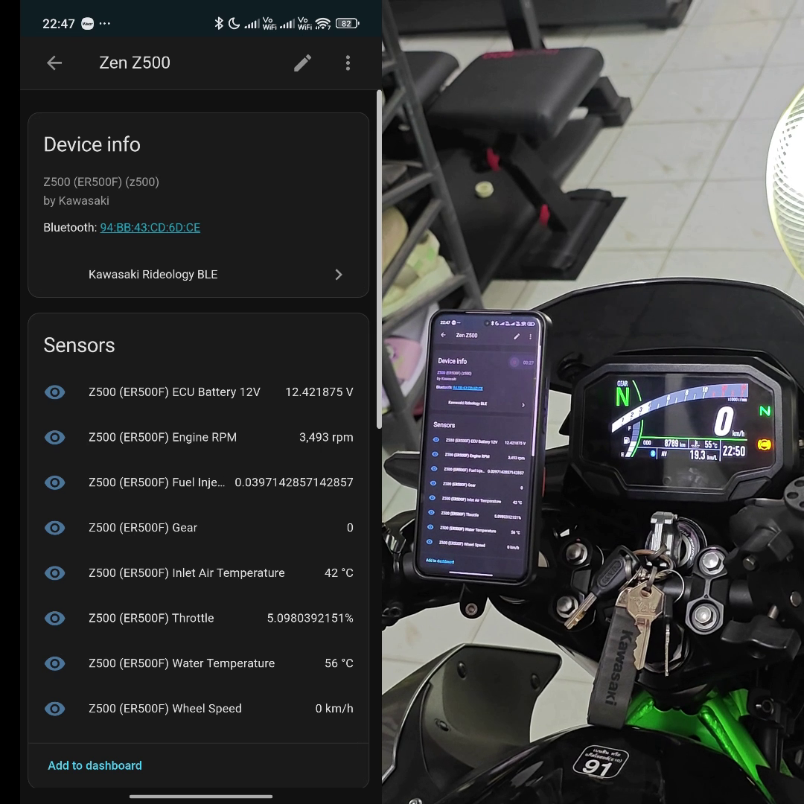

[](https://github.com/hacs/integration)
[](LICENSE)


# Kawasaki Rideology BLE

A Home Assistant custom integration that connects to Kawasaki motorcycles over Rideology BLE to expose telemetry and status sensors.

## Demo

[Watch demo (mp4)](img/z500-demo.mp4)

<video src="img/z500-demo.mp4" alt="Kawasaki Rideology BLE" width="100%"></video>

## Installation

HACS:
1. Add this repository to HACS as a custom repository (Integration).
2. Install `Kawasaki Rideology BLE`.
3. Restart Home Assistant.

Manual:
1. Copy `custom_components/kawasaki` to `/config/custom_components/kawasaki`.
2. Restart Home Assistant.

## Configuration

You can add `Kawasaki Rideology BLE` from the Home Assistant UI.

[](https://my.home-assistant.io/redirect/config_flow_start/?domain=kawasaki)

Notes:
- Bluetooth must be enabled in Home Assistant.
- This integration can work with `bluetooth_proxy`; see [Bluetooth Proxy Integration](#bluetooth-proxy-integration).

## Supported Bike Models

The currently supported bike models are defined in `custom_components/kawasaki/const.py`.

| Model Key | Bike Name | Config File |
| --- | --- | --- |
| `z500` | `Z500 (ER500F)` | `z500_er500f_config.json` |

## Bluetooth Proxy Integration

This integration was designed to work through Home Assistant `bluetooth_proxy`, but BLE devices that require passkey pairing are not fully supported by upstream ESPHome at the moment.

For now, use the temporary patched `bluetooth_proxy` component from:
`https://github.com/Zen3515/esphome/tree/z500_bluetooth_proxy_w_passcode`

### Notes / Requirements
- This patch is compatible with **ESPHome v2026.1.3** only.

- Using **Wi-Fi + BLE on the same device** may lead to BLE supervision timeouts and unstable connections (due to radio coexistence under load). For reliable operation, prefer:
  - **Ethernet-based ESP32** deployments, or
  - **ESP32-C5** on a **5 GHz-only** SSID, or
  - **`esp32_hosted`** as an alternative (experimental).

This includes the following changes:

1. Target-specific behavior is hard-coded for the bike address `0xAABBCCDDEEFF` and passkey `833454`, so special logic applies only to that device.  
2. The connect flow now forces rebonding on every target connect request (removing the stored bond first), with a 2s reconnect cooldown after close to avoid immediate re-pair races.  
3. Unpair flow for the target is now safer: if unpairing is requested while connected, it disconnects first, then removes the bond after close (deferred unpair).  
4. During target sessions, the scanner is paused to reduce radio contention; on close, it restores scan behavior. Wi-Fi power save is also forced to `NONE` during the session and restored afterward (when Wi-Fi is enabled).  
5. Pairing/auth is automated for the target: it accepts security requests, auto-replies with the passkey, auto-confirms numeric comparison, and forces MITM encryption.  
6. “Connected” signaling was gated for the target so connection is exposed only when both GATT readiness and auth readiness are satisfied (more deterministic startup).  
7. Connection parameter handling was added for GAP update events; target params are relaxed to safer bounds (20–40 ms interval, >=8 s supervision timeout) when peer requests aggressive values.  
8. GATT auth level now uses MITM for target read/write/descriptor operations instead of always `NONE`.  
9. Writes to target handle `0x002C` are now serialized with in-flight tracking, queueing (limit 8), drain-on-complete, and queue reset on failure/disconnect.  
10. Observability was expanded: congestion events, notify forwarding failures, payload previews, disconnect activity timing, plus BLE core plumbing to forward `ESP_GAP_BLE_UPDATE_CONN_PARAMS_EVT` and `ESP_GAP_BLE_KEY_EVT`.  
11. Base BLE client now allows derived classes to skip default pre-/post-connect parameter settings; `BluetoothConnection` uses this to bypass default params for the target.  
12. Minor tracker coexistence tweak: coex preference is only flipped back when continuous scanning is actually enabled, matching your “scan paused while target connected” behavior.  


### Temporary ESPHome Setup (Passkey Support)

1. Clone the patched ESPHome repository branch:
   ```bash
   git clone --depth 1 --branch z500_bluetooth_proxy_w_passcode https://github.com/Zen3515/esphome.git
   ```
2. Edit the target Bluetooth MAC address and enter your passkey in `esphome/components/bluetooth_proxy/bluetooth_connection.cpp` and `esphome/components/bluetooth_proxy/bluetooth_proxy.cpp`.
3. In your ESPHome config directory, create `external_components/z500_patches`.
4. Copy `esphome/components/bluetooth_proxy` `esphome/components/esp32_ble` `esphome/components/esp32_ble_tracker` `esphome/components/esp32_ble_client` from the cloned repo into `external_components/z500_patches`.
5. Add this to your ESPHome node YAML:

```yaml
esp32:
  board: ...
  framework:
    # type: arduino
    type: esp-idf
    sdkconfig_options: # esp-idf specific flag
      CONFIG_BT_BLUEDROID_PINNED_TO_CORE_CHOICE: "0"
      CONFIG_BT_CTRL_PINNED_TO_CORE_CHOICE: "0"      # IDF 5.x
      CONFIG_BTDM_CTRL_PINNED_TO_CORE_CHOICE: "0"  # IDF 4.x
      CONFIG_ESP32_WIFI_TASK_CORE_ID: "1"

external_components:
  - source:
      type: local
      path: external_components/z500_patches/
    components:
      - bluetooth_proxy
      - esp32_ble
      - esp32_ble_tracker
      - esp32_ble_client

esp32_ble_tracker:
  scan_parameters:
    active: true

bluetooth_proxy:
  active: true
  connection_slots: 3

esp32_ble:
  io_capability: keyboard_only
  max_connections: 4
  connection_timeout:
    seconds: 30

```

This is a temporary workaround. When passkey pairing support is fully available upstream, this integration will be updated.

## How to Add Support for a New Bike Model

For each bike, Bluetooth should appear as `Kawasaki-XXXX`, where `XXXX` is the model identifier.

To add support for a new model, create a model config file.  
For example, for a Z500:
`custom_components/kawasaki/configs/z500_er500f_config.json`

This file defines:
- The startup sequence
- Telemetry capability flags and related configuration

If the bike has an IMU, configure it in this file.

You can manually experiment with this file to add support for your motorcycle, but the proper method is to retrieve the values from the API directly.  
If you need help with that process, please send me a personal message. In the future, there may be a script to automate this.

### Model Config Generation

After you obtain these three configs:
- `tuning_config`
- `common_service_config`
- `info_config`

Use `tools/make_ble5_config.py` to generate a starter model config:

```bash
python3 tools/make_ble5_config.py \
  --info-config 4020F640000511FC77D417FFFFFFFFFFFFFFFFFFFFFFFFFFFFFFFFFFFFFFFFFFFFFFFF \
  --tuning-config 4716FC4700051260FFFFFFFFFFFFFFFFFFFFFFFFFFFFFFFFFF \
  --common-service-config 1D0CFA1D00FFFFFFFFFFFFFFFFFFFF \
  --model "Kawasaki-ER500F" \
  --out z500_er500f_config.json
```

### Startup Frame and Profile

This step requires sniffing.

On Android, you can use the Bluetooth HCI log from Developer Options.  
Open the log in Wireshark, identify the frame ID/profile data, and update your model config.

### Final Tuning

There are several parameters you may need to tune, such as:
- `control_write_with_response`
- `debug_frames`
- `log_all_frames`
- `require_startup_responses`
- `startup_no_wait_frames`

Set these based on trial and error for your specific bike model.

## Disclaimer

This integration is highly experimental. Interacting with vehicle systems can be risky and may cause accidents or damage.  
The main purpose of this repository is to access data for education and telemetry. It is **not** intended to modify vehicle behavior.

By using this integration, you acknowledge that it is provided "as is" and at your own risk. To the fullest extent permitted by applicable law, the developer and contributors disclaim all liability for any loss, damage, injury, or other consequences arising from the use or misuse of this code.

`Kawasaki` and the Kawasaki logo are trademarks of Kawasaki Motors, Ltd. (or its affiliates). This project is unofficial and is not affiliated with, authorized, sponsored, or endorsed by Kawasaki Motors, Ltd. All trademarks, service marks, and logos are the property of their respective owners.

## Support

If you have discovered a problem or want to request a feature, please open an issue.

Pull requests are welcome.
